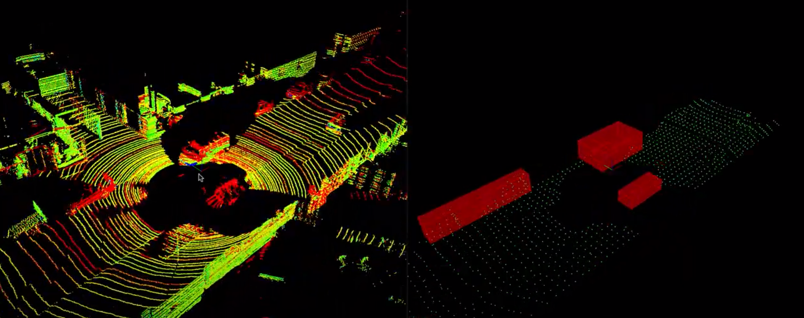

# 3D Lidar Obstacle Detection


**Lidar** sensing gives us high resolution data by sending out thousands of laser signals. These lasers bounce off objects, returning to the sensor where we can then determine how far away objects are by timing how long it takes for the signal to return. Also we can tell a little bit about the object that was hit by measuring the intesity of the returned signal. Each laser ray is in the infrared spectrum, and is sent out at many different angles, usually in a 360 degree range. While lidar sensors gives us very high accurate models for the world around us in 3D, they are currently very expensive.

[](https://www.youtube.com/watch?v=Y0bmX5s6ojk)


## Workspace


* Ubuntu 18.04
* PCL - v1.8.1
* C++ v14
* gcc v5.5

**Note** The [[CMakeLists.txt](https://github.com/udacity/SFND_Lidar_Obstacle_Detection/blob/master/CMakeLists.txt)] file provided in this repo can be used locally if you have the same package versions as mentioned above. If you want to run this project locally (outside the Udacity workspace), please follow the steps under the **Local Installation** section.


## Local Installation

### Ubuntu 

1. Clone this github repo:

   ```sh
   cd ~
   git clone https://github.com/TriKnight/3D_lidar_obstacle_detection
   ```

2.  Edit **CMakeLists.txt** as follows:

   ```
cmake_minimum_required(VERSION 2.8 FATAL_ERROR)

add_definitions(-std=c++14)

set(CXX_FLAGS "-Wall")
set(CMAKE_CXX_FLAGS, "${CXX_FLAGS}")

project(playback)

find_package(PCL 1.8.1 REQUIRED) #PCL version 1.8.1 for Ubutu 18.04

include_directories(${PCL_INCLUDE_DIRS})
link_directories(${PCL_LIBRARY_DIRS})
add_definitions(${PCL_DEFINITIONS})
list(REMOVE_ITEM PCL_LIBRARIES "vtkproj4")


add_executable (environment src/environment.cpp src/render/render.cpp src/processPointClouds.cpp)
target_link_libraries (environment ${PCL_LIBRARIES})
   ```

3. Execute the following commands in a terminal

   ```shell
   sudo apt install libpcl-dev
   cd ~/3D_lidar_obstacle_detection
   mkdir build && cd build
   cmake ..
   make
   ./environment
   ```

   This should install the latest version of PCL. You should be able to do all the classroom exercises and project with this setup.

### MAC

#### Install via Homebrew
1. install [homebrew](https://brew.sh/)
2. update homebrew 
	```bash
	$> brew update
	```
3. add  homebrew science [tap](https://docs.brew.sh/Taps) 
	```bash
	$> brew tap brewsci/science
	```
4. view pcl install options
	```bash
	$> brew options pcl
	```
5. install PCL 
	```bash
	$> brew install pcl
	```
6. install cmake
   ```
   brew install cmake
   ```
7. Clone this github repo

   ```shell
   cd ~
   git clone https://github.com/TriKnight/3D_lidar_obstacle_detection
   ```

8.  Edit the CMakeLists.txt file as shown in Step 2 of Ubuntu installation instructions above.

9. Execute the following commands in a terminal

   ```shell
   cd ~/lidar
   mkdir build && cd build
   cmake ..
   make
   ./environment
   ```

#### Build from Source

[PCL Source Github](https://github.com/PointCloudLibrary/pcl)

[PCL Mac Compilation Docs](https://pcl.readthedocs.io/projects/tutorials/en/latest/compiling_pcl_macosx.html#compiling-pcl-macosx)

## Algorithms
1. RANSAC algorithm

1. Euclidean Cluster Extraction


## Troubleshooting 
1. Fix error can not find PCL, eigen, vtk,.. library in VSCode→ adding configurations

Solution: 

- Click to Edit “includePath” setting
- Include path find the dependence and putting it to this box
```

${workspaceFolder}/**
/usr/include/pcl-1.8
/usr/include/eigen3
/usr/include/vtk-6.3
workspace/.vscode/c_cpp_properties.json
{
   "configurations": [
       {
           "name": "Linux",
           "includePath": [
               "${workspaceFolder}/**",
               "/usr/include/pcl-1.8",
               "/usr/include/eigen3",
               "/usr/include/vtk-6.3"
           ],
           "defines": [],
           "compilerPath": "/usr/bin/gcc",
           "cStandard": "gnu11",
           "cppStandard": "gnu++14",
           "intelliSenseMode": "linux-gcc-x64"
       },
       {
           "name": "pcl_lib",
           "includePath": [
               "${workspaceFolder}/**"
           ],
           "defines": [],
           "compilerPath": "/usr/bin/gcc",
           "cStandard": "gnu11",
           "cppStandard": "gnu++14",
           "intelliSenseMode": "linux-gcc-x64"
       }
   ],
   "version": 4
}

```

## References
1. Radu Bogdan Rusu, *"Semantic 3D Object Maps for Everyday Manipulation in Human Living Environments"* 
2. Sensor Fusion Udacity (https://www.udacity.com/course/sensor-fusion-engineer-nanodegree--nd313)
3. https://en.wikipedia.org/wiki/Random_sample_consensus
4. https://brilliant.org/wiki/dot-product-distance-between-point-and-a-line/
5. https://pcl.readthedocs.io/en/latest/cluster_extraction.html